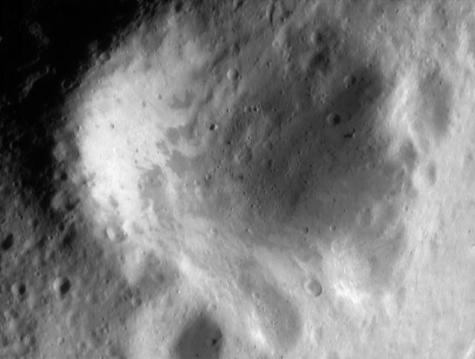

I didn’t do my normal yoga routine this morning. I jumped on my bike in 23 degree weather and rode out errands. after the first errand my leg to hip joint started to hurt . The pain went down my leg a bit. I’ m not one to keep track and monitor every little head ache and chill that I get. I can often just think the pains away by just not worrying about them.
Not this one in my leg to hip joint I blame on my not doing yoga in the morning and the cold temperature.
### Later...
Now I will do some yoga, it is Sunday, so I am at home in the warmth.
As noted in my entry earlier I do a spot of yoga in the morning. 

I am not really a student of yoga, more of a improviser.
If any one has yoga ideas or poses or comments please send them to me. This is Heavy Yoga, there is no right or wring way. It is not the only way, But this is non-secret. There is no hidden knowledge.
######Crater Psyche on near-Earth asteroid 433 Eros

There is no long stoic path, no masters here, it's for everyone.
