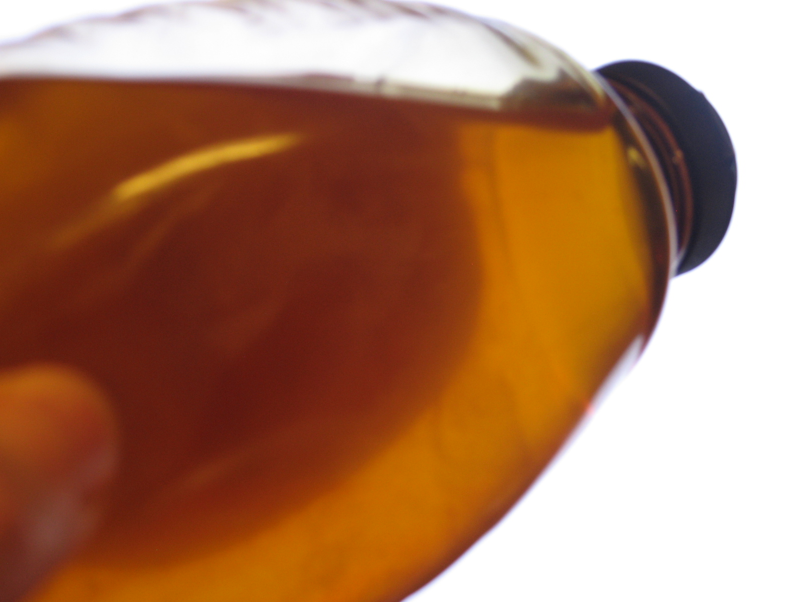

Honey has so many beneficial properties that it is hard to start writing about it.
One caution, don’t give honey to kids under one year old. Honey has botulinum endospores: bacteria spores. A baby’s digestive tract cannot kill these spores and the little tick can get botulism. yuck!

So good! More for us grow ups over one year old.

Bees gather nectar in their honey stomachs, that nectar is passed to another bees that chew the honey with enzymes. The honey is spread around the hive where the water evaporates. Finished honey is sealed in honey cells until eaten by bees as needed.

Honey has been used in medicine since ancient times. Before the age of pharmacology in the 20th century honey was a major ingredient in most medicines.
A study at University of Pennsylvania found that plain honey was more effective against coughs than a honey-flavored dextromethorphan cough syrup.

Here is link,
http://today.reuters.com/news/articlenews.aspx?type=healthNews&storyid=2007-12-03T215021Z_01_WRI378511_RTRUKOC_0_US-HONEY-EASES-NIGHTTIME-COUGH.xml

Honey spread on burns and wounds is an old practice. It has anti-inflammatory, antibacterial and soothing effects.
On a wound honey produces hydrogen peroxide, which is thought to contribute to its antibacterial effects.

Bert’s Bees Wax uses honey skin creams.

I have my own skin perpetration that uses honey. The honey from the farmer’s market is the best. Uncooked and unfiltered has the most beneficial properties.

Here is a skin lotion I use every day on my face:
2 teaspoons sweet uncooked almond oil
One teaspoon food grade rose water, from the Indian spice store.
And two large drops of honey.
That’s it.
Don’t worry too much about the proportions. But too much honey makes the preparation sticky on one’s skin. Ok it is still honey.
If you have any left over you can drink it.

### H3 Vestibulum orci tortor, sollicitudin ac euismod non, placerat ac augue.

### Donec hendrerit laoreet risus eget adipiscing.

Nullam eros mi, mollis in sollicitudin non, tincidunt sed enim. Sed et felis metus, rhoncus ornare nibh. Ut at magna leo. Suspendisse egestas est ac dolor imperdiet pretium. Lorem ipsum dolor sit amet, consectetur adipiscing elit. Nam porttitor, erat sit amet venenatis luctus, augue libero ultrices quam, ut congue nisi risus eu purus. Cras semper consectetur elementum. Nulla vel aliquet libero. Vestibulum eget felis nec purus commodo convallis. Aliquam erat volutpat.

Proin suscipit luctus orci placerat fringilla. Suspendisse in urna ligula, a volutpat mauris. Sed enim mi, bibendum eu pulvinar vel, sodales vitae dui. Pellentesque sed sapien lorem, at lacinia urna. In hac habitasse platea dictumst. Vivamus vel justo in leo laoreet ullamcorper non vitae lorem. Lorem ipsum dolor sit amet, consectetur adipiscing elit. Proin bibendum ullamcorper rutrum.
