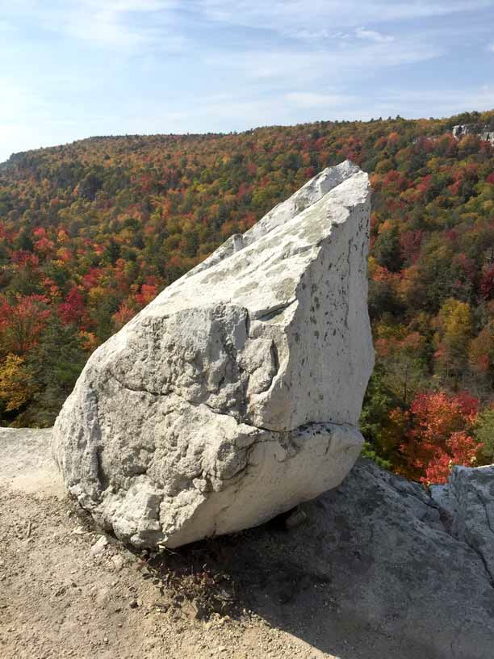

:thumbsup: :smile: :sparkler:

Gravity is the weakest force, in Heavy Yoga gravity does all the work. A flat pile of rocks pressing into the earth, being as flat as it can, this is Heavy Yoga. 

Laziness, falling, and slumping are all virtues in Heavy Yoga. 
Extra effort is always discouraged. 
Heavy Yoga is observance of weight on the world and the body. There are a limited number of Heavy Yoga movements. These poses require no effort. 
Heavy Yoga is not edgy or athletic. 

Heavy yoga is for people who may not be tired but the best thing to do is nothing. Let gravity do the work for you, that is what gravity is therefore, to take the weight and hold it to earth. 

Gravity is love; loving is just stronger than liking. 

### Extra effort is always discouraged.

